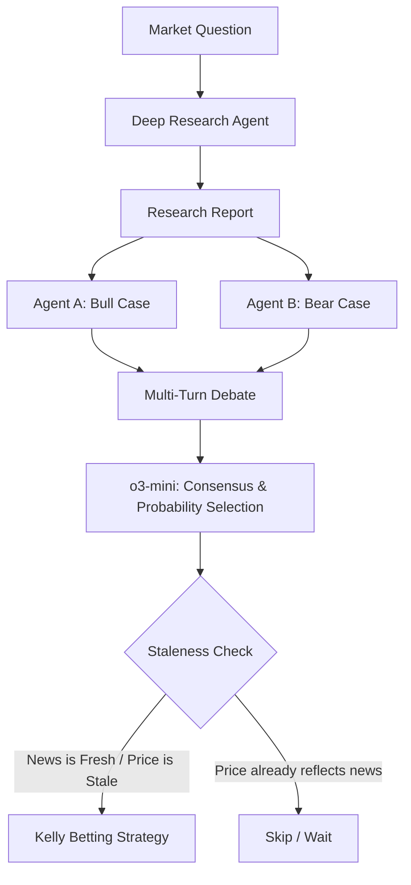

# Blueprint for a Superior Trading Agent (Prophet++)

Building a "better" agent starting from the successful **Prediction Prophet GPT-4o** involves moving from a linear pipeline to a multi-stage, adversarial, and data-aware system.

Here are four high-impact upgrades categorized by their complexity and potential "alpha" (profit edge).

## 1. The Adversarial "Debate" Phase (Logic Edge)
**Current Prophet**: One agent researches, one agent predicts.
**Upgrade**: Have two identical GPT-4o agents (a "Bull" and a "Bear") debate the research findings.
*   **How it works**:
    *   **Agent A** is tasked with finding reasons why the outcome will be **YES**.
    *   **Agent B** is tasked with finding reasons why the outcome will be **NO**.
    *   A **Moderator Agent** (using a reasoning model like `o1` or `o3-mini`) reviews the debate to determine which side has stronger evidence.
*   **Why it's better**: It forces the LLM to overcome "confirmation bias" where it might latch onto the first piece of news it finds.

## 2. Staleness Detection (Arbitrage Edge)
**Current Prophet**: Predicts the probability of the event.
**Upgrade**: Predict the "Staleness" of the current market price.
*   **How it works**:
    *   Monitor the time of the latest high-impact news vs. the time of the last significant price move in the market.
    *   If a major event happened 10 minutes ago but the market price hasn't shifted, you have an **information edge**.
*   **Implementation**: Use `get_certified_relevant_news_since_cached` (found in Prophet's code) to specifically trigger trades only when the news-to-price latency is high.

## 3. Bayesian Structural Analysis (Structural Edge)
**Current Prophet**: Asks "Will X happen?"
**Upgrade**: Build a dependency tree of the event.
*   **How it works**:
    *   Break the question into **Conditional Scenarios**.
    *   *Example*: "Will Nvidia stock hit $150 by June?" becomes:
        1. "Will the next earnings report beat expectations by >10%?" (60% prob)
        2. "Will the FED keep rates unchanged?" (80% prob)
    *   Combine these using a Bayesian model.
*   **Why it's better**: It gives the agent a "world model" rather than just a "pattern matching" model.

## 4. Probabilistic Calibration (Statistical Edge)
**Current Prophet**: Outputs a raw probability (e.g., 75%).
**Upgrade**: Apply an **Isotonic Regression** layer based on historical performance.
*   **How it works**:
    *   Keep a log of every time the agent said "75%".
    *   If in reality, those turned out to be "Yes" only 60% of the time, your agent is **overconfident**.
    *   Automatically scale the agent's output using historical accuracy data before calculations the Kelly bet.

---

## Recommended "Prophet++" Architecture

### Pro-Tip: The "Reasoning" Model Swap
Use **GPT-4o** for the "Research" phase (where speed and search integration are key), but use **OpenAI's o1 or o3-mini** for the final "Consensus" or "Prediction" phase. The reasoning models are significantly better at "sanity checking" probabilities than standard chat models.
